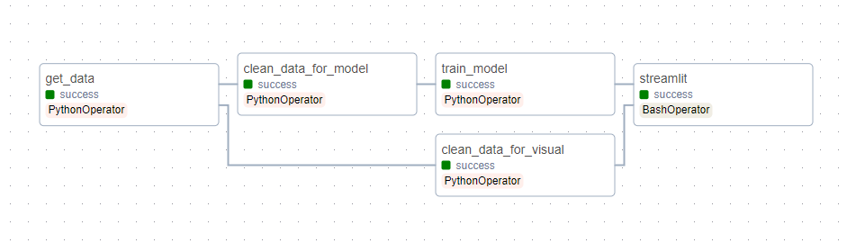

# ImmoEliza Airflow Project

The goal of this project was to consolidate our previous immo projects into one workflow, using Apache Airflow. 

Here are the tasks:

- Scrape every night all the apartments on sale.
- Scrape every night all the houses on sale.
- Make an interactive dashboard to analyze the market.
- Train a regression model and evaluate its performance.

And the requirements:

- Datasets need to be versioned.
- Models need to be versioned.
- Different pre-processing for analyzing data and for training models.
## Installation

Clone the project to your local machine. 

You will need to install WSL2 to run the project. 

In a terminal, run the following command to install wsl: 

```bash
  wsl --install
```

An Ubuntu instance will be installed on your local machine. 

You will need to install Apache Airflow on this Ubuntu instance. 

Please refer to the following guide for this installation: [Installation Guide](https://medium.com/international-school-of-ai-data-science/setting-up-apache-airflow-in-windows-using-wsl-dbb910c04ae0) 

After installing Apache Airflow, install the required libraries through the requirements.txt file

```bash
  pip3 install requirements.txt
```
## Usage

To run the Apache Airflow server you will need to launch 2 Ubuntu terminals, one for the webserver and one for the scheduler. 

The Airflow UI is hosted on http://localhost:8080/ by default. 

Due to a limitation of WSL, you will need to access the Streamlit webapp manually. 

By default, it is hosted on port 8051 on the network IP of your Ubuntu instance. 

If required, you can run the following code in your Ubuntu terminal to check it's IP:

```bash
  ip addr
```

The workflow has 5 tasks:



- Scrape every night all the apartments/houses on sale. (Workflow currently scrapes a limited amount to prevent extreme waiting times)
- Preprocess the data for visualization.
- Preprocess the data for training a model.
- Train a regression model and save it. 
- Generate graphs, prediction and create a Streamlit webapp. 

Every file is versioned with the day's date. 